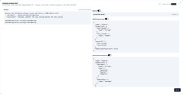

# Hypersigil

<p align="center">

</p>

## What is Hypersigil?

**Hypersigil** is an AI prompt management platform that enables organizations to centralize, optimize, and dynamically deploy AI workflows across multiple providers. It provides a unified, collaborative environment for developing, testing, and hot-swapping prompts without code redeployments.

Designed for both technical and non-technical users, Hypersigil bridges domain expertise and AI implementation through multimodal prompt management. It supports seamless transitions between different AI providers, models, and execution contexts, allowing teams to rapidly iterate and optimize AI-driven processes.

Key capabilities include real-time prompt hot-swapping, cross-provider orchestration, and intelligent workflow adaptation—empowering teams to build scalable, flexible AI solutions with unprecedented agility.


## Screenshots
<p align="center">
<a href="docs/images/prompt-view.png" target="_blank"></a>
<a href="docs/images/prompt-calibration.png" target="_blank"></a>
<a href="docs/images/execution-list.png" target="_blank"></a>
<a href="docs/images/execution-details.png" target="_blank"></a>
<a href="docs/images/execution-bundles.png" target="_blank"></a>
<a href="docs/images/schedule-execution.png" target="_blank"></a>
<a href="docs/images/art-crit-prompt.png" target="_blank"></a>
<a href="docs/images/art-crit-file.png" target="_blank"></a>
<a href="docs/images/art-crit-execution.png" target="_blank"></a>
<a href="docs/images/settings.png" target="_blank"></a>
</p>

🚧 The project is under heavy development, more fetures will be added soon. We're taking feature requests and welcome any contributions. 🚧

## Use Cases

- **Centralized Prompt Management**: Single source of truth for all prompts with API integration, enabling hot-swapping without code deployments
- **Non-Technical Collaboration**: Role-based access allowing domain experts to test, comment, and refine prompts without technical knowledge
- **Multi-Provider AI Gateway**: Test and compare prompts across OpenAI, Anthropic, Ollama (more providers soon) with cost optimization and automatic failover
- **Complete Prompt Lifecycle**: Systematic development, testing, collaboration, and production monitoring with full audit trails
- **Hot-swapping**: Use deployments to hot-swap prompts without redeployments
- **Enterprise Governance**: Compliance-ready with access controls, audit trails, and systematic validation against regulatory scenarios

## Features

<details>

<summary>Centralized Prompt Management</summary>

- **Single Source of Truth**: All prompts managed outside codebases
- **Version Control**: Track prompt evolution without Git commits
- **Template Variables**: Dynamic prompts with Mustache templating
- **API Integration**: Hot-swapping prompts without code deployments

<summary>Prompt Execution System</summary>

- **Multi-Provider Support**: Execute prompts across Ollama, OpenAI, Anthropic, and other AI providers
- **Asynchronous Processing**: Background execution with real-time status tracking
- **Provider Health Monitoring**: Automatic failover and health checking
- **Execution Bundles**: Organize and track related prompt executions

</details>

<details>
<summary>Test Data Management</summary>

- **Systematic Testing**: Create test data groups for comprehensive prompt validation
- **Batch Execution**: Run prompts against multiple test cases simultaneously
- **Data Import**: Import test datasets from various formats (csv, markdown, json)
- **Result Analysis**: Compare outcomes across different test scenarios

</details>
<details>
<summary>Prompt Calibration</summary>

- **Intelligent Adjustment**: AI-powered prompt refinement based on execution results
- **Comment System**: Collaborative feedback and analysis of prompt performance
- **Version Control**: Track prompt evolution and performance over time

</details>
<details>
<summary>User Management</summary>

- **Role-Based Access**: Admin, user, and viewer roles with appropriate permissions
- **Invitation System**: Secure user onboarding with invitation links
- **API Key Management**: Centralized management of AI provider credentials
- **Collaborative Workflows**: Team-based prompt development and testing

</details>
<details>
<summary>Developer Experience</summary>

- **RESTful Architecture**: Clean, well-documented API endpoints

</details>

## Full documentation

https://hypersigilhq.github.io/hypersigil/introduction/

REST API docs - https://hypersigilhq.github.io/hypersigil/api-reference/

## Run with Docker

### Using Pre-built Image

Pull and run the latest Hypersigil image from Docker Hub:

```bash
docker run -d --name hypersigil -p 8080:80 -v $(pwd)/hypersigil:/app/data --init codefibers/hypersigil:latest
```

### Building Your Own Image

<details><summary>If you prefer to build the Docker image yourself instead of pulling from the registry</summary>

### Prerequisites
- Node.js 18+ 
- npm or yarn
- (Optional) Ollama for local AI models

1. **Clone the repository**:
   ```bash
   git clone git@github.com:hypersigilhq/hypersigil.git
   cd hypersigil
   ```

2. **Run the build script**:
   ```bash
   ./build-docker.sh
   ```

   This script will:
   - Build the Vue.js frontend for production
   - Compile the TypeScript backend
   - Create a Docker image tagged as `codefibers/hypersigil:latest`
   - Provide you with ready-to-use run commands

3. **Run your locally built image**:
   ```bash
   # Run on port 8080
   docker run -d --name hypersigil -p 8080:80 -v $(pwd)/backend/.env:/app/.env -v $(pwd)/hypersigil:/app/data --init hypersigil:latest
   ```

### Docker Run Parameters Explained

- `-d`: Run container in detached mode (background)
- `--name hypersigil`: Assign a name to the container for easy management
- `-p 8080:8080`: Map host port 8080 to container port 80 (change first number for different host port)
- `-v $(pwd)/hypersigil:/app/data`: Mount data directory for persistent storage
- `--init`: Use proper init system for signal handling
</details>

## Getting Started with local development
<details><summary>Details</summary>

### Prerequisites
- Node.js 18+ 
- npm or yarn
- (Optional) Ollama for local AI models

### Installation

1. **Clone the repository**
   ```bash
   git clone <repository-url>
   cd hypersigil
   ```

2. **Install backend dependencies**
   ```bash
   cd backend
   npm install
   ```

3. **Install frontend dependencies**
   ```bash
   cd ../ui
   npm install
   ```

4. **Configure environment**
   ```bash
   cd ../backend
   cp .env.example .env
   # Edit .env with your configuration
   ```

5. **Start the development servers**
   
   Backend:
   ```bash
   cd backend
   npm run dev
   ```
   
   Frontend (in a new terminal):
   ```bash
   cd ui
   npm run dev
   ```

6. **Access the application**
   - Frontend: http://localhost:5173
   - Backend API: http://localhost:3000

</details>

## Architecture
<details>
<summary>Architecture</summary>

### Backend
- **Node.js/TypeScript**: Type-safe server implementation
- **Express.js**: RESTful API framework
- **SQLite**: Lightweight, embedded database
- **ts-typed-api**: Type-safe API definitions shared between frontend and backend

### Frontend
- **Vue 3**: Modern reactive framework with Composition API
- **TypeScript**: Full type safety across the application
- **Tailwind CSS**: Utility-first styling framework
- **shadcn/ui**: Beautiful, accessible component library

### AI Providers
- **Ollama**: Local AI model execution
- **OpenAI**: GPT models and embeddings
- **Anthropic**: Advanced reasoning and analysis
- **Extensible**: Plugin system for additional providers
</details>

## Contributing

We welcome contributions from fellow reality hackers and prompt magicians!


## License

Hypersigil is licensed under Apache 2.0 with Commons Clause. This means:

- ✅ **Internal business use is allowed** - You can use Hypersigil within your organization for internal purposes
- ✅ **Modification and distribution** - You can modify the code and distribute it
- ✅ **Building applications** - You can create applications that use Hypersigil
- ❌ **Commercial selling prohibited** - You cannot sell Hypersigil itself as a product or service

The Commons Clause restriction only applies to selling the software itself. You are free to use it internally, modify it, and build upon it for your business needs.

For the complete license terms, see the [LICENSE](LICENSE) file.

Contact: piotr (at) codefibers.pl
